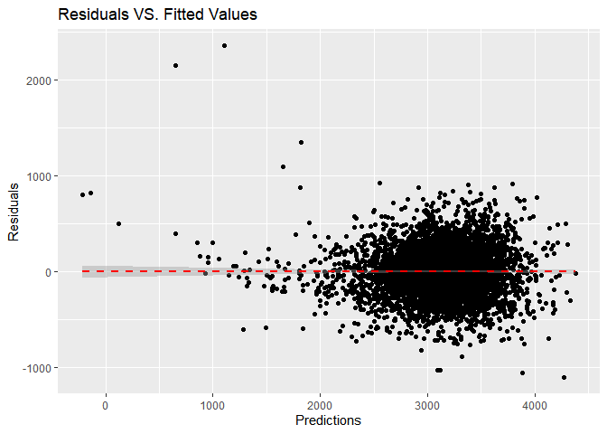
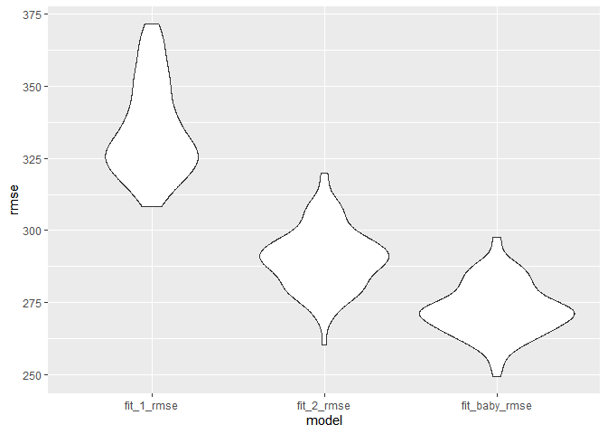
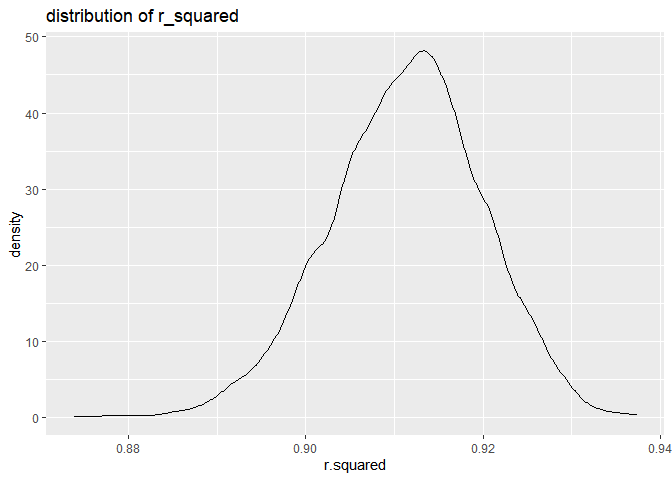
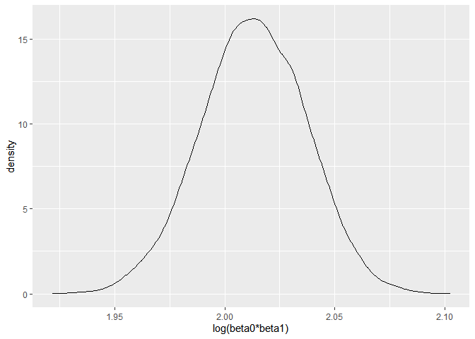

p8105\_hw6\_zh2493
================

``` r
library(tidyverse)
```

    ## Warning: 程辑包'tidyr'是用R版本4.1.2 来建造的

``` r
library(modelr)
```

## Problem1

``` r
### load data and clean
baby_df = 
  read_csv("./data/birthweight.csv") %>% 
  mutate(babysex = ifelse(babysex == 1, "male", "female"),
         frace = recode_factor(frace, '1' = 'White', '2' = 'Black', '3' = 'Asian', '4' = 'Puerto Rican', '8' = 'Other', '9' = 'Unknown'),
         mrace = recode_factor(mrace, '1' = 'White', '2' = 'Black', '3' = 'Asian', '4' = 'Puerto Rican', '8' = 'Other'),
         malform = recode_factor(malform, '0' = 'absent', '1' = 'present')
  )
```

### model

I choose the backward stepwise regression. Calculate the AIC score to
select variables.

``` r
baby_fit =
  lm(bwt ~ ., data = baby_df) %>% 
  step(direction = "both") 
```

    ## Start:  AIC=48717.83
    ## bwt ~ babysex + bhead + blength + delwt + fincome + frace + gaweeks + 
    ##     malform + menarche + mheight + momage + mrace + parity + 
    ##     pnumlbw + pnumsga + ppbmi + ppwt + smoken + wtgain
    ## 
    ## 
    ## Step:  AIC=48717.83
    ## bwt ~ babysex + bhead + blength + delwt + fincome + frace + gaweeks + 
    ##     malform + menarche + mheight + momage + mrace + parity + 
    ##     pnumlbw + pnumsga + ppbmi + ppwt + smoken
    ## 
    ## 
    ## Step:  AIC=48717.83
    ## bwt ~ babysex + bhead + blength + delwt + fincome + frace + gaweeks + 
    ##     malform + menarche + mheight + momage + mrace + parity + 
    ##     pnumlbw + ppbmi + ppwt + smoken
    ## 
    ## 
    ## Step:  AIC=48717.83
    ## bwt ~ babysex + bhead + blength + delwt + fincome + frace + gaweeks + 
    ##     malform + menarche + mheight + momage + mrace + parity + 
    ##     ppbmi + ppwt + smoken
    ## 
    ##            Df Sum of Sq       RSS   AIC
    ## - frace     4    124365 320848704 48712
    ## - malform   1      1419 320725757 48716
    ## - ppbmi     1      6346 320730684 48716
    ## - momage    1     28661 320752999 48716
    ## - mheight   1     66886 320791224 48717
    ## - menarche  1    111679 320836018 48717
    ## - ppwt      1    131132 320855470 48718
    ## <none>                  320724338 48718
    ## - fincome   1    193454 320917792 48718
    ## - parity    1    413584 321137922 48721
    ## - mrace     3    868321 321592659 48724
    ## - babysex   1    853796 321578134 48727
    ## - gaweeks   1   4611823 325336161 48778
    ## - smoken    1   5076393 325800732 48784
    ## - delwt     1   8008891 328733230 48823
    ## - blength   1 102050296 422774634 49915
    ## - bhead     1 106535716 427260054 49961
    ## 
    ## Step:  AIC=48711.51
    ## bwt ~ babysex + bhead + blength + delwt + fincome + gaweeks + 
    ##     malform + menarche + mheight + momage + mrace + parity + 
    ##     ppbmi + ppwt + smoken
    ## 
    ##            Df Sum of Sq       RSS   AIC
    ## - malform   1      1447 320850151 48710
    ## - ppbmi     1      6975 320855679 48710
    ## - momage    1     28379 320877083 48710
    ## - mheight   1     69502 320918206 48710
    ## - menarche  1    115708 320964411 48711
    ## - ppwt      1    133961 320982665 48711
    ## <none>                  320848704 48712
    ## - fincome   1    194405 321043108 48712
    ## - parity    1    414687 321263390 48715
    ## + frace     4    124365 320724338 48718
    ## - babysex   1    852133 321700837 48721
    ## - gaweeks   1   4625208 325473911 48772
    ## - smoken    1   5036389 325885093 48777
    ## - delwt     1   8013099 328861802 48817
    ## - mrace     3  13540415 334389119 48885
    ## - blength   1 101995688 422844392 49908
    ## - bhead     1 106662962 427511666 49956
    ## 
    ## Step:  AIC=48709.53
    ## bwt ~ babysex + bhead + blength + delwt + fincome + gaweeks + 
    ##     menarche + mheight + momage + mrace + parity + ppbmi + ppwt + 
    ##     smoken
    ## 
    ##            Df Sum of Sq       RSS   AIC
    ## - ppbmi     1      6928 320857079 48708
    ## - momage    1     28660 320878811 48708
    ## - mheight   1     69320 320919470 48708
    ## - menarche  1    116027 320966177 48709
    ## - ppwt      1    133894 320984044 48709
    ## <none>                  320850151 48710
    ## - fincome   1    193784 321043934 48710
    ## + malform   1      1447 320848704 48712
    ## - parity    1    414482 321264633 48713
    ## + frace     4    124393 320725757 48716
    ## - babysex   1    851279 321701430 48719
    ## - gaweeks   1   4624003 325474154 48770
    ## - smoken    1   5035195 325885346 48775
    ## - delwt     1   8029079 328879230 48815
    ## - mrace     3  13553320 334403471 48883
    ## - blength   1 102009225 422859375 49906
    ## - bhead     1 106675331 427525481 49954
    ## 
    ## Step:  AIC=48707.63
    ## bwt ~ babysex + bhead + blength + delwt + fincome + gaweeks + 
    ##     menarche + mheight + momage + mrace + parity + ppwt + smoken
    ## 
    ##            Df Sum of Sq       RSS   AIC
    ## - momage    1     29211 320886290 48706
    ## - menarche  1    117635 320974714 48707
    ## <none>                  320857079 48708
    ## - fincome   1    195199 321052278 48708
    ## + ppbmi     1      6928 320850151 48710
    ## + malform   1      1400 320855679 48710
    ## - parity    1    412984 321270064 48711
    ## + frace     4    125020 320732060 48714
    ## - babysex   1    850020 321707099 48717
    ## - mheight   1   1078673 321935752 48720
    ## - ppwt      1   2934023 323791103 48745
    ## - gaweeks   1   4621504 325478583 48768
    ## - smoken    1   5039368 325896447 48773
    ## - delwt     1   8024939 328882018 48813
    ## - mrace     3  13551444 334408523 48881
    ## - blength   1 102018559 422875638 49904
    ## - bhead     1 106821342 427678421 49953
    ## 
    ## Step:  AIC=48706.02
    ## bwt ~ babysex + bhead + blength + delwt + fincome + gaweeks + 
    ##     menarche + mheight + mrace + parity + ppwt + smoken
    ## 
    ##            Df Sum of Sq       RSS   AIC
    ## - menarche  1    100121 320986412 48705
    ## <none>                  320886290 48706
    ## - fincome   1    240800 321127090 48707
    ## + momage    1     29211 320857079 48708
    ## + ppbmi     1      7479 320878811 48708
    ## + malform   1      1678 320884612 48708
    ## - parity    1    431433 321317724 48710
    ## + frace     4    124743 320761547 48712
    ## - babysex   1    841278 321727568 48715
    ## - mheight   1   1076739 321963029 48719
    ## - ppwt      1   2913653 323799943 48743
    ## - gaweeks   1   4676469 325562760 48767
    ## - smoken    1   5045104 325931394 48772
    ## - delwt     1   8000672 328886962 48811
    ## - mrace     3  14667730 335554021 48894
    ## - blength   1 101990556 422876847 49902
    ## - bhead     1 106864308 427750598 49952
    ## 
    ## Step:  AIC=48705.38
    ## bwt ~ babysex + bhead + blength + delwt + fincome + gaweeks + 
    ##     mheight + mrace + parity + ppwt + smoken
    ## 
    ##            Df Sum of Sq       RSS   AIC
    ## <none>                  320986412 48705
    ## + menarche  1    100121 320886290 48706
    ## - fincome   1    245637 321232048 48707
    ## + momage    1     11698 320974714 48707
    ## + ppbmi     1      8823 320977589 48707
    ## + malform   1      1884 320984528 48707
    ## - parity    1    422770 321409181 48709
    ## + frace     4    128726 320857686 48712
    ## - babysex   1    846134 321832545 48715
    ## - mheight   1   1012240 321998651 48717
    ## - ppwt      1   2907049 323893461 48743
    ## - gaweeks   1   4662501 325648912 48766
    ## - smoken    1   5073849 326060260 48771
    ## - delwt     1   8137459 329123871 48812
    ## - mrace     3  14683609 335670021 48894
    ## - blength   1 102191779 423178191 49903
    ## - bhead     1 106779754 427766166 49950

``` r
summary(baby_fit)
```

    ## 
    ## Call:
    ## lm(formula = bwt ~ babysex + bhead + blength + delwt + fincome + 
    ##     gaweeks + mheight + mrace + parity + ppwt + smoken, data = baby_df)
    ## 
    ## Residuals:
    ##      Min       1Q   Median       3Q      Max 
    ## -1097.18  -185.52    -3.39   174.14  2353.44 
    ## 
    ## Coefficients:
    ##                     Estimate Std. Error t value Pr(>|t|)    
    ## (Intercept)       -6070.2639   136.9081 -44.338  < 2e-16 ***
    ## babysexmale         -28.5580     8.4549  -3.378 0.000737 ***
    ## bhead               130.7770     3.4466  37.944  < 2e-16 ***
    ## blength              74.9471     2.0190  37.120  < 2e-16 ***
    ## delwt                 4.1067     0.3921  10.475  < 2e-16 ***
    ## fincome               0.3180     0.1747   1.820 0.068844 .  
    ## gaweeks              11.5925     1.4621   7.929 2.79e-15 ***
    ## mheight               6.5940     1.7849   3.694 0.000223 ***
    ## mraceBlack         -138.7925     9.9071 -14.009  < 2e-16 ***
    ## mraceAsian          -74.8868    42.3146  -1.770 0.076837 .  
    ## mracePuerto Rican  -100.6781    19.3247  -5.210 1.98e-07 ***
    ## parity               96.3047    40.3362   2.388 0.017004 *  
    ## ppwt                 -2.6756     0.4274  -6.261 4.20e-10 ***
    ## smoken               -4.8434     0.5856  -8.271  < 2e-16 ***
    ## ---
    ## Signif. codes:  0 '***' 0.001 '**' 0.01 '*' 0.05 '.' 0.1 ' ' 1
    ## 
    ## Residual standard error: 272.3 on 4328 degrees of freedom
    ## Multiple R-squared:  0.7181, Adjusted R-squared:  0.7173 
    ## F-statistic: 848.1 on 13 and 4328 DF,  p-value: < 2.2e-16

The result of stepwise regression provide these variables:  
babysex, bhead, blength, delwt, fincome, gaweeks, mheight, mrace,
parity, ppwt, smoken  
So

``` r
fit_baby = lm(bwt ~ babysex + bhead + blength + delwt + fincome + gaweeks + mheight + mrace + parity + ppwt + smoken, data = baby_df)
```

#### resuduals and predictions and plot :

``` r
fit_df = 
  baby_df %>% 
  modelr::add_residuals(fit_baby) %>% 
  modelr::add_predictions(fit_baby)

fit_df %>%   
  ggplot(aes(x = pred, y = resid)) + 
  geom_point() +
  geom_smooth(method = "lm", color = "red", linetype = 2) + 
  labs(
    title = "Residuals VS. Fitted Values",
    x = "Predictions",
    y = "Residuals"
  )
```

<!-- -->

#### Compare to two others

model 1 using length at birth and gestational age as predictors (main
effects only) model 2 using head circumference, length, sex, and all
interactions (including the three-way interaction) between these

``` r
fit_1 = lm(bwt ~ blength + gaweeks, data = baby_df) %>% 
  broom::tidy()

fit_2 = lm(bwt ~ bhead * blength * babysex, data = baby_df) %>% 
  broom::tidy()
```

#### crossv\_mc

``` r
cv_df = 
  crossv_mc(baby_df, 100) %>% 
  mutate(
    train = map(train, as_tibble),
    test = map(test, as_tibble)) %>% 
  
  mutate(
    fit_baby = map(train, ~lm(bwt ~ babysex + bhead + blength + delwt + fincome + gaweeks + mheight + mrace + parity + ppwt + smoken, data = baby_df)),
    fit_1 = map(.x = train,~lm(bwt ~ blength + gaweeks, data = .x)),
    fit_2 = map(.x = train,~lm(bwt~ bhead*blength*babysex, data = .x)),
  ) %>% 
  
  mutate(
    fit_baby_rmse = map2_dbl(fit_baby, test, ~rmse(model = .x, data = .y)),
    fit_1_rmse = map2_dbl(fit_1, test, ~rmse(model = .x, data = .y)),
    fit_2_rmse = map2_dbl(fit_2, test, ~rmse(model = .x, data = .y))
  ) %>% 
  select(ends_with('rmse')) %>% 
  pivot_longer(
    everything(),
    names_to = 'model',
    values_to = 'rmse'
  ) %>% 
    ggplot(aes(x = model, y = rmse)) + geom_violin()
cv_df
```

<!-- -->

we could find that my model has lowest rmse, which means that it could
be the best model among these three models, and the fit\_2(using head
circumference, length, sex) is better than fit\_1(sing length at birth
and gestational age as predictors).

## Problem 3

``` r
weather_df = 
  rnoaa::meteo_pull_monitors(
    c("USW00094728"),
    var = c("PRCP", "TMIN", "TMAX"), 
    date_min = "2017-01-01",
    date_max = "2017-12-31") %>%
  mutate(
    name = recode(id, USW00094728 = "CentralPark_NY"),
    tmin = tmin / 10,
    tmax = tmax / 10) %>%
  select(name, id, everything())
```

    ## Registered S3 method overwritten by 'hoardr':
    ##   method           from
    ##   print.cache_info httr

    ## using cached file: C:\Users\lenovo\AppData\Local/Cache/R/noaa_ghcnd/USW00094728.dly

    ## date created (size, mb): 2021-10-05 10:37:08 (7.617)

    ## file min/max dates: 1869-01-01 / 2021-10-31

### Bootstrap

``` r
set.seed(1)
weather_bootst = 
  weather_df %>% 
  modelr::bootstrap(n = 5000) %>% 
  mutate(
    models = map(strap, ~lm(tmax ~ tmin, data = .x) ),
    results = map(models, broom::tidy),
    glance = map(models, broom::glance)) %>% 
  unnest(results,glance) %>% 
  select(id = .id, term, estimate, r.squared) 
```

    ## Warning: unnest() has a new interface. See ?unnest for details.
    ## Try `df %>% unnest(c(results, glance))`, with `mutate()` if needed

### Plot the distribution of r^2

``` r
weather_bootst %>% 
  ggplot(aes(x = r.squared)) + 
  geom_density() +
  labs(title = 'distribution of r_squared')
```

<!-- -->
the density plot shows that r\_squared follows an approximately normal
distribution.

### 95% confidence interval for r^2

``` r
weather_bootst %>% 
  summarize(
    ci_lower = quantile(r.squared, 0.025), 
    ci_upper = quantile(r.squared, 0.975)) %>% 
  knitr::kable()
```

| ci\_lower | ci\_upper |
|----------:|----------:|
| 0.8936684 |  0.927106 |

The 95% confidence interval of the estimated r^2 value is (0.8936684,
0.927106) \#\#\#\# Plot the distribution of log(beta0\*beta1)

``` r
log_df = 
  weather_bootst %>% 
  pivot_wider(
    names_from = term,
    values_from = estimate
  ) %>%
  mutate(intercept = `(Intercept)`,
    log_value = log(intercept*tmin))

log_df %>% 
  ggplot(aes(x = log_value)) +
  geom_density() +
  xlab("log(beta0*beta1)")
```

<!-- -->
The density plot shows that log(beta0∗beta1) follows an approximately
normal distribution.

#### 95% confidence interval for log(beta0∗beta1)

``` r
log_df %>% 
  summarize(
    ci_lower = quantile(log_value, 0.025), 
    ci_upper = quantile(log_value, 0.975)) %>% 
  knitr::kable()
```

| ci\_lower | ci\_upper |
|----------:|----------:|
|  1.964949 |  2.058887 |

The 95% confidence interval of the estimated log(beta0∗beta1) value is
(1.96, 2.06).
